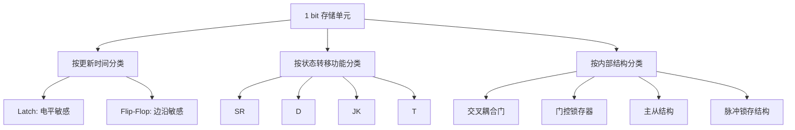
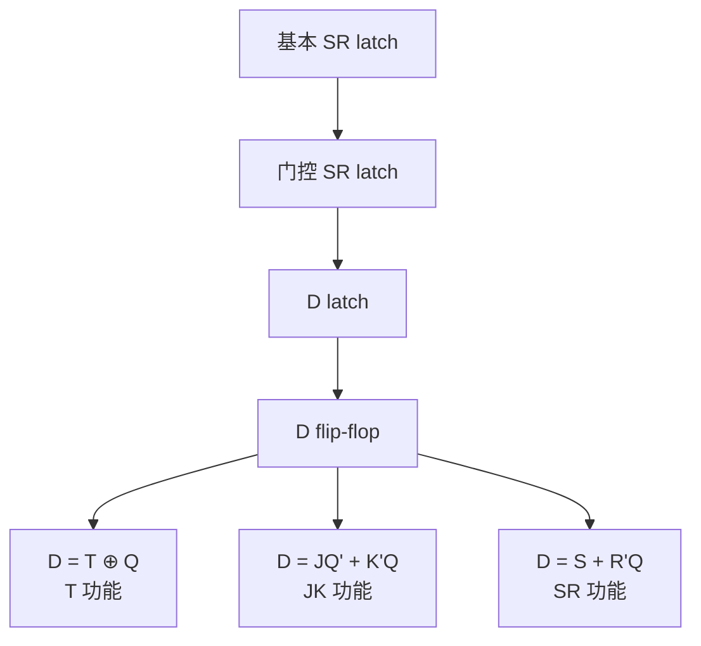

> **先用现代数字设计视角建立清晰主线，再把教材中的写法放回这套框架中解释。**

## 总体框架



| 分类维度 | 关注的问题 | 典型分类 |
| -------- | ----------------------- | ------------------------------------------ |
| 更新时间 | 什么时候允许状态变化？ | 电平敏感、边沿敏感 |
| 状态功能 | 下一状态 $Q^+$ 怎么算？ | SR、D、JK、T |
| 内部结构 | 电路怎么搭出来？ | 基本锁存器、门控锁存器、主从结构、脉冲结构 |

---

## 第一部分：分类方式

### 2. Latch 和 Flip-Flop

| 名称 | 中文常用名 | 敏感方式 | 行为 |
| --------- | ---------- | -------- | ------------------------------ |
| latch | 锁存器 | 电平敏感 | 使能有效期间，输入可能影响输出 |
| flip-flop | 触发器 | 边沿敏感 | 只在时钟边沿采样输入 |


### 3. 电平敏感和边沿敏感

| 类型 | 有效时间 | 输入什么时候影响输出 | 典型器件 |
| -------- | ------------------------ | -------------------------- | -------------------------------------- |
| 电平敏感 | 一整个高电平或低电平期间 | 有效电平期间都可能影响输出 | D latch、SR latch |
| 边沿敏感 | 上升沿或下降沿附近 | 只在边沿采样一次 | D flip-flop、JK flip-flop、T flip-flop |

示意图：

```
电平敏感 latch：

EN: ___--------___
 ↑↑↑↑
 这整段时间透明


边沿敏感 flip-flop：

CLK: ___----____
 ↑
 只在这里采样
```

### 4. 功能分类：SR、D、JK、T

这些名字描述的是：

```
Q 的下一状态 Q⁺ 如何由输入和当前 Q 决定
```

| 类型 | 输入 | 主要功能 | 核心方程 |
| ---- | ---- | ---------------------- | ------------------------------------- |
| SR | S、R | 置位、复位、保持 | $Q^+ = S + \overline{R}Q$ |
| D | D | 直接装入数据 | $Q^+ = D$ |
| JK | J、K | 保持、置位、复位、翻转 | $Q^+ = J\overline{Q} + \overline{K}Q$ |
| T | T | 保持、翻转 | $Q^+ = T \oplus Q$ |

---

 
## 第二部分：各种器件详解

### 5. SR 锁存器

#### 5.1 名字含义

| 符号 | 英文 | 含义 |
|---|---|---|
| S | Set | 置 1 |
| R | Reset | 置 0 |

SR 锁存器是最基础的 1 bit 存储结构。

#### 5.2 功能表

默认讨论高电平有效 SR 锁存器：

| S | R | $$Q^+$$ | 功能 |
|---|---|---|---|
| 0 | 0 | $$Q$$ | 保持 |
| 0 | 1 | 0 | 复位 |
| 1 | 0 | 1 | 置位 |
| 1 | 1 | 非法 | 禁止 |

#### 5.3 特性方程

$$
Q^+ = S + \overline{R}Q
$$

附加条件：

$$
SR = 0
$$

也就是：

```text
S 和 R 不能同时为 1
```

---

#### 5.4 结构示意

以高电平有效 NOR 型 SR 锁存器为例：

```text
 ┌─────┐
 R ────▶│ NOR │──── Q
 └──┬──┘
 │
 │ feedback
 ▼
 ┌─────┐
 S ────▶│ NOR │──── Q'
 └─────┘
```

**SR latch = 两个互相反馈的逻辑门**

### 6. 门控 SR 锁存器

普通 SR 锁存器会随时响应输入。
为了控制它什么时候响应，需要加入使能信号 $$EN$$。

#### 6.1 结构关系

$$
S' = EN \cdot S
$$

$$
R' = EN \cdot R
$$

示意图：

```text
S ──┬── AND ── S'
EN ─┘

R ──┬── AND ── R'
EN ─┘

S', R' 再进入 SR latch
```

---

#### 6.2 功能表

| EN | S | R | $$Q^+$$ | 功能 |
|---|---|---|---|---|
| 0 | x | x | $$Q$$ | 保持 |
| 1 | 0 | 0 | $$Q$$ | 保持 |
| 1 | 0 | 1 | 0 | 复位 |
| 1 | 1 | 0 | 1 | 置位 |
| 1 | 1 | 1 | 非法 | 禁止 |

#### 6.3 重点

| 项目 | 内容 |
|---|---|
| 类型 | latch |
| 敏感方式 | 电平敏感 |
| 本质 | SR latch 外面加 EN 控制 |
| 问题 | 仍然有 $$S=R=1$$ 的非法输入 |
| 教材中可能叫法 | 门控 SR 锁存器、电平触发 SR 触发器 |

### 7. D 锁存器

D 锁存器的想法是：只给一个数据输入 $$D$$，避免 SR 的非法状态。

#### 7.1 从 SR 得到 D

令：

$$
S = D
$$

$$
R = \overline{D}
$$

于是：

| D | S | R | $$Q^+$$ |
|---|---|---|---|
| 0 | 0 | 1 | 0 |
| 1 | 1 | 0 | 1 |

这样永远不会出现：

$$
S=R=1
$$

所以 D 锁存器消除了 SR 锁存器的非法输入。

#### 7.2 重点

| 项目 | 内容 |
|---|---|
| 类型 | latch |
| 敏感方式 | 电平敏感 |
| 输入 | D、EN |
| 解决的问题 | 消除了 SR 的非法输入 |
| 行为 | EN 有效期间，Q 可能跟随 D |
| 教材中可能叫法 | D 锁存器、电平触发 D 触发器 |

### 8. D 触发器

D flip-flop 是现代数字电路中最常用的触发器。

#### 8.1 D latch 和 D flip-flop 对比

| 器件 | 更新时间 | 方程 | 关键区别 |
|---|---|---|---|
| D latch | EN 有效电平期间 | $$Q^+ = D$$ | 电平敏感 |
| D flip-flop | CLK 边沿 | $$Q^+ = D$$ | 边沿敏感 |

注意：

```text
它们的状态功能都可以写成 Q⁺ = D，
区别主要是"什么时候装入 D"。
```

#### 8.2 正边沿 D 触发器

| 时刻 | 行为 |
|---|---|
| 非上升沿 | Q 保持 |
| CLK 上升沿 | Q 采样 D |

可以写成：

$$
Q^+ = D
$$

但要补充条件：

```text
只在 CLK 上升沿更新
```

#### 8.3 主从结构理解

D flip-flop 可以概念性地理解为两个 D latch 串联：

```text
D → Master latch → Slave latch → Q
```

```text
 ┌────────────┐ ┌────────────┐
D ────▶ │ Master │ ───▶ │ Slave │ ───▶ Q
 │ D latch │ │ D latch │
 └────────────┘ └────────────┘
 ▲ ▲
 │ │
 CLK CLK'
```

一种典型过程：

| CLK | Master latch | Slave latch | Q |
|---|---|---|---|
| 1 | 打开，接收 D | 关闭，保持 | 不变 |
| 0 | 关闭，保持 | 打开，更新 | 改变 |

从外面看，Q 只在时钟翻转附近更新，因此表现为边沿触发。

### 9. JK 触发器

JK 可以看成改良版 SR。

SR 的问题是：

**S = R = 1 非法**

JK 的改进是：

**J = K = 1 时规定为翻转**

#### 9.1 功能表

| J | K | $$Q^+$$ | 功能 |
|---|---|---|---|
| 0 | 0 | $$Q$$ | 保持 |
| 0 | 1 | 0 | 复位 |
| 1 | 0 | 1 | 置位 |
| 1 | 1 | $$\overline{Q}$$ | 翻转 |

#### 9.2 特性方程

$$
Q^+ = J\overline{Q} + \overline{K}Q
$$

#### 9.3 重点

| 项目 | 内容 |
|---|---|
| 类型 | flip-flop |
| 敏感方式 | 通常作为边沿敏感或脉冲 / 主从结构来讨论 |
| 优点 | 功能最全 |
| 功能 | 保持、置位、复位、翻转 |
| 教学意义 | 很适合讲触发器之间的转换 |
| 工程地位 | 现代 RTL 中不如 D flip-flop 常用 |

### 10. T 触发器

T 是 Toggle，意思是翻转。

#### 10.1 功能表

| T | $$Q^+$$ | 功能 |
|---|---|---|
| 0 | $$Q$$ | 保持 |
| 1 | $$\overline{Q}$$ | 翻转 |

---

#### 10.2 特性方程

$$
Q^+ = T \oplus Q
$$

也可以写成：

$$
Q^+ = \overline{T}Q + T\overline{Q}
$$

#### 10.3 重点

| 项目 | 内容 |
|---|---|
| 类型 | flip-flop |
| 输入 | T |
| 功能 | 控制是否翻转 |
| 常见用途 | 计数器、分频器 |

---

## 第三部分：教材中的分类放到这套框架中
 

### 11. 三个分类维度的关系

教材同时混用了三个分类维度，造成了很多困惑。这一节把它们的关系理清楚。

#### 11.1 三个维度分别是什么

| 维度 | 回答的问题 | 典型分类 |
|------|-----------|---------|
| 触发方式 | 什么时候允许状态变化？ | 电平触发、边沿触发、脉冲触发 |
| 逻辑功能 | 下一状态 $Q^+$ 怎么算？ | SR、D、JK、T |
| 内部结构 | 电路怎么实现？ | 基本锁存器、门控锁存器、主从结构、脉冲结构 |

#### 11.2 为什么教材会造成困惑

教材的讲法是：

1. 先讲最基础结构：SR 锁存器
2. 再按触发方式讲：电平触发、边沿触发、脉冲触发
3. 又按逻辑功能讲：SR、JK、T、D

于是会造成一种错觉：

```text
电平触发下面有 SR 和 D；
边沿触发下面只有 D；
脉冲触发下面有 SR 和 JK；
逻辑功能下面又有 SR、JK、T、D。
```

但正确理解应该是：

- 电平 / 边沿 / 脉冲 是**什么时候更新**
- SR / D / JK / T 是**更新成什么**
- 门控 / 主从 / 脉冲结构 是**怎么实现**

这三个维度是**互相独立**的，可以自由组合。

#### 11.3 更清晰的二维整理方式

把"触发方式"和"逻辑功能"分开排成二维表：

| 逻辑功能 \ 控制方式 | 电平敏感 latch | 边沿敏感 flip-flop | 脉冲 / 主从实现 |
|---|---|---|---|
| **SR** | SR latch、gated SR latch | edge-triggered SR FF | pulse / master-slave SR FF |
| **D** | D latch | D FF | pulse D structure |
| **JK** | JK latch 较少强调 | edge-triggered JK FF | pulse / master-slave JK FF |
| **T** | T latch 较少强调 | T FF | pulse / master-slave T FF |

这个表最重要。它说明：

**SR、D、JK、T 可以和不同控制方式组合。**
**教材只是选了一部分典型器件来讲，不代表其他组合不存在。**

### 12. 教材叫法与现代视角对照表

| 教材中的说法 | 现代视角下更推荐的理解 | 说明 |
|---|---|---|
| SR 锁存器 | SR latch | 最基础的双稳态存储结构 |
| 门控 SR 锁存器 | gated SR latch | SR latch 外面加 EN 控制 |
| 电平触发的 SR 触发器 | level-sensitive SR latch | 传统教材把它叫"触发器"，现代更倾向叫 latch |
| 电平触发的 D 触发器 | D latch | EN / CLK 有效电平期间透明 |
| 边沿触发的 D 触发器 | D flip-flop | 只在时钟边沿采样 D |
| 脉冲触发的 SR 触发器 | pulse-triggered / master-slave SR flip-flop | 内部可能用主从或脉冲方式，外部效果接近边沿触发 |
| 脉冲触发的 JK 触发器 | pulse-triggered / master-slave JK flip-flop | 教材常用 JK 讲脉冲 / 主从，因为 JK 功能更全 |
| 按逻辑功能分 SR、JK、T、D | SR、JK、T、D 是状态转移功能分类 | 和电平 / 边沿 / 脉冲不是同一维度 |

---
### 13. 脉冲触发和边沿触发的关系

| 类型 | 本质 | 有效时间 | 你可以怎么想 |
| -------- | -------------------------- | ------------ | ------------------ |
| 电平触发 | 门打开一整段电平时间 | 较长 | 门开着，输入能进来 |
| 脉冲触发 | 门只打开一个很窄的时间窗口 | 很短一段时间 | 门快速开一下又关上 |
| 边沿触发 | 理想化为只在边沿采样一次 | 一个时刻 | 拍一张照片 |


 

## 第四部分：互相转化

### 14. 从 SR latch 演化出其他器件



文字版：

```text
SR latch
→ gated SR latch
→ D latch
→ D flip-flop
→ 用 D flip-flop + 组合逻辑实现 SR / JK / T
```

### 15. 用 JK 触发器变成其他触发器

JK 功能最全，所以可以通过约束输入变成 SR、D、T。

#### 15.1 JK 变 SR

令：

$$
J = S
$$

$$
K = R
$$

注意：**用 JK 模拟 SR 时，必须禁止 S = R = 1**

#### 15.2 JK 变 D

D 触发器要求：

```text
D = 0 → Q⁺ = 0
D = 1 → Q⁺ = 1
```

JK 中：

```text
置 0：J = 0, K = 1
置 1：J = 1, K = 0
```

所以令：

$$
J = D
$$

$$
K = \overline{D}
$$

#### 15.3 JK 变 T

T 触发器要求：

```text
T = 0：保持
T = 1：翻转
```

JK 中：

```text
J = K = 0：保持
J = K = 1：翻转
```

所以令：

$$
J = K = T
$$

#### 15.4 JK 转换总表

| 目标器件 | JK 输入连接方式 | 注意 |
|---|---|---|
| SR | $$J=S,\ K=R$$ | 禁止 $$S=R=1$$ |
| D | $$J=D,\ K=\overline{D}$$ | 无非法状态 |
| T | $$J=K=T$$ | T=1 时翻转 |

### 16. 用 D 触发器实现其他功能

现代工程里更常用这种思路：

```text
D flip-flop + 组合逻辑 = 其他触发器功能
```

因为 D flip-flop 本身满足：

$$
Q^+ = D
$$

所以只要把目标触发器的 $$Q^+$$ 接到 D 输入即可。

#### 16.1 D 实现 SR

SR 需要：

$$
Q^+ = S + \overline{R}Q
$$

所以令：

$$
D = S + \overline{R}Q
$$

并且仍然要求：

$$
SR = 0
$$

#### 16.2 D 实现 JK

JK 需要：

$$
Q^+ = J\overline{Q} + \overline{K}Q
$$

所以令：

$$
D = J\overline{Q} + \overline{K}Q
$$

#### 16.3 D 实现 T

T 需要：

$$
Q^+ = T \oplus Q
$$

所以令：

$$
D = T \oplus Q
$$

结构示意：

```text
 ┌───────┐
T ─────▶│ XOR │──── D ───▶ DFF ───▶ Q
Q ─────▶│ │ │
 └───────┘ │
 ▲ │
 └─────────────────┘
```

#### 16.4 D 实现其他触发器总表

| 目标功能 | 目标方程 | D 输入接什么 |
|---|---|---|
| D | $$Q^+ = D$$ | $$D$$ |
| SR | $$Q^+ = S + \overline{R}Q$$ | $$S + \overline{R}Q$$ |
| JK | $$Q^+ = J\overline{Q} + \overline{K}Q$$ | $$J\overline{Q} + \overline{K}Q$$ |
| T | $$Q^+ = T \oplus Q$$ | $$T \oplus Q$$ |

---

## 第五部分：总表整理

### 17. 器件对比总表

| 器件 | 类型 | 敏感方式 | 输入 | 特性方程 | 主要用途 |
|---|---|---|---|---|---|
| SR latch | 锁存器 | 直接反馈 / 电平敏感 | S、R | $$Q^+ = S+\overline{R}Q$$ | 基础存储 |
| gated SR latch | 锁存器 | EN 电平敏感 | S、R、EN | EN=1 时按 SR 工作 | 可控 SR 存储 |
| D latch | 锁存器 | EN 电平敏感 | D、EN | $$Q^+=EN\cdot D+\overline{EN}\cdot Q$$ | 电平透明存储 |
| D flip-flop | 触发器 | 边沿敏感 | D、CLK | $$Q^+=D$$ | 寄存器 |
| JK flip-flop | 触发器 | 边沿敏感 / 脉冲实现 | J、K、CLK | $$Q^+=J\overline{Q}+\overline{K}Q$$ | 功能转换 |
| T flip-flop | 触发器 | 边沿敏感 | T、CLK | $$Q^+=T\oplus Q$$ | 计数器、分频器 |

### 18. 名字含义总表

| 名称 | 英文 | 名字含义 | 核心想法 |
|---|---|---|---|
| SR | Set-Reset | 置位 / 复位 | 直接控制 Q 置 1 或置 0 |
| D | Data | 数据 | 把 D 存进去 |
| JK | J-K | 改良版 SR | $$J=K=1$$ 时翻转 |
| T | Toggle | 翻转 | 控制是否翻转 |
| latch | Latch | 锁住、扣住 | 电平有效期间透明 |
| flip-flop | Flip-Flop | 状态翻转器件 | 边沿采样并保持 |

### 19. 方程总表

| 器件 | 特性方程 | 约束 |
|---|---|---|
| SR | $$Q^+ = S + \overline{R}Q$$ | $$SR=0$$ |
| D | $$Q^+ = D$$ | 无 |
| JK | $$Q^+ = J\overline{Q} + \overline{K}Q$$ | 无 |
| T | $$Q^+ = T \oplus Q$$ | 无 |
| D latch | $$Q^+ = EN\cdot D+\overline{EN}\cdot Q$$ | 无 |
| gated SR latch | EN=1 时：$$Q^+ = S+\overline{R}Q$$ | $$SR=0$$ |